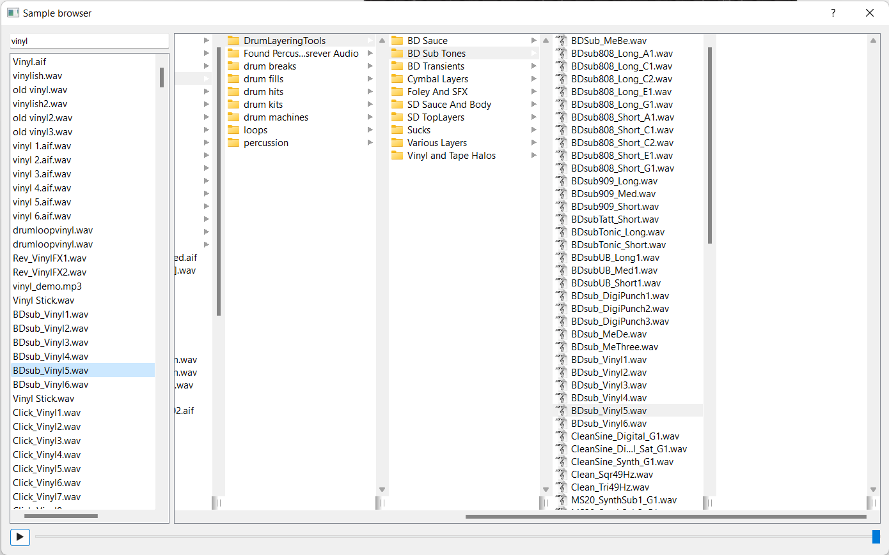

## About

This project came out from the need for the simple [audio sample](https://en.wikipedia.org/wiki/Sampling_(music)) browser based on the actual filesystem
hierarchy rather than fancy database (which is great when you know what are you looking for but not when just trying to pick something fresh and interesting).

I have already found that column view known from Apple macOS Finder file browser is great for quickly browsing
through file collection. What's not so great is that previewing (opening and listening) media files is rather clunky and takes
some time to open. What's more, there is no equivalent for column view in Windows world unless you decide to use third
party file browser. This application aims to fill that gap.

<figure>
<a href="docs/main_window_screenshot.png"></a>
<figcaption>Main application window</figcaption>
</figure>

Note: I didn't really intend to roll my own media browser, but since (Py)QT already provides all the tools needed to do that
(MVC classes for filesystem and column view) it was really tempting to create a proof of concept at very least... and this
is what it is at the moment - a proof of concept until I get to implement all the features I need myself for efficient
music production. Stay tuned!

## Installation

Install poetry if not already installed:

```shell
python -m pip install poetry
```

Then:

```shell
python -m poetry install
```

## Running

```shell
python -m poetry run samplexplore
```
